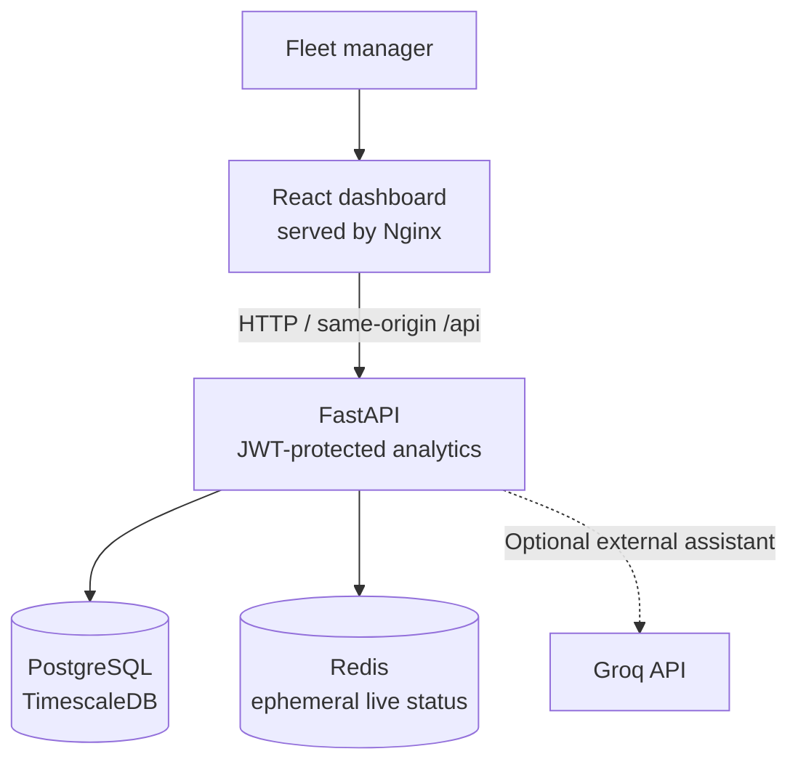

# Fleet Fuel, Idling & Utilisation Cost Intelligence

**Individual submission:** Kshitij Totawar (sole contributor); **Email:** kshitij.totawar@gmail.com

A local fleet-analytics demo that converts synthetic vehicle telemetry into
trips, idle events, estimated daily fuel/energy costs, utilisation metrics,
and a ranked list of vehicles to investigate. Its strength is a complete,
repeatable local product journey: fresh fleet data is generated, analyzed,
served through an API, explored in a dashboard, and removed on teardown.

> **How to read the results:** the local walkthrough is intentionally sized
> for dependable judging on a developer laptop: 1,000 vehicles over seven
> synthetic days. This demonstrates the end-to-end product behavior. Larger
> dataset validation and streaming throughput are separate engineering tests;
> see the status and rationale below before interpreting any scale numbers.

## What the project does

1. Generates plausible, route-consistent synthetic telemetry for a mixed fleet
   of petrol, diesel, hybrid, and electric vehicles.
2. Stores the event history and fleet data in PostgreSQL/TimescaleDB.
3. Segments ordered telemetry into trips and idle periods.
4. Calculates daily fuel, idle, and utilisation summaries using stated
   synthetic assumptions.
5. Exposes fleet summary, ranked offenders, and vehicle drill-down APIs through
   FastAPI.
6. Displays the weekly story in a React dashboard: fleet totals, progressively
   loaded offender leaderboard, and vehicle-level details.
7. Demonstrates a separate Redpanda-to-consumer streaming path, with Redis for
   ephemeral live vehicle status.
8. Can optionally send database-derived context to Groq for assistant answers.

The dashboard's costs and efficiency figures are grounded in explicit,
consistent synthetic assumptions. They make the workflow understandable and
repeatable, but are not real vehicle measurements, live prices, or validated
savings. See
[`docs/algorithms.md`](docs/algorithms.md).

## Run the local demo

The normal demo needs Docker Desktop (or Docker Engine) with Docker Compose
v2. The images are built from the repository. You do not need host-installed
Python or Node.js to start the full stack.

### 1. Install and start Docker

Install Docker Desktop for macOS/Windows or Docker Engine with the Compose
plugin on Linux. Start Docker Desktop/the Docker service, then confirm it is
available:

```bash
docker --version
docker compose version
docker info
```

The Compose stack publishes the dashboard on port `80` and the API on port
`8000`. Ensure those ports are available before startup.

### 2. Clone the repository

```bash
git clone https://github.com/KT2006/Motorq-Hackathon.git
cd Motorq-Hackathon
```

If you already have a local clone, enter its repository directory and pull the
branch/revision you want to run before continuing.

### 3. Build and start the complete demo

```bash
docker compose up --build
```

The first build downloads base images and installs application dependencies,
so it can take longer than later starts. Compose starts PostgreSQL/TimescaleDB,
Redis, Redpanda, PgBouncer, and the ingestion consumer. The one-shot seeder
generates the default **1,000 vehicles × 7 days**, writes telemetry, segments
all balanced-profile vehicles, builds daily cost summaries, and publishes
sample live events. The API waits for the seeder to exit successfully before
starting; the dashboard starts after the API is healthy.

Leave this terminal open to view startup logs. Wait for the API and dashboard
services to start and for the seeder to report completion. The dashboard may
take a few minutes on the first build and seed.

### 4. Open the product

- **Dashboard:** <http://localhost>
- **API health:** <http://localhost:8000/health>
- **Interactive API documentation:** <http://localhost:8000/docs>

With no local credential overrides, sign in using:

```text
Username: admin
Password: changeme
```

These are known demo credentials, and Compose also has a local fallback JWT
signing key. They are strictly for a private local demo. Never expose this
configuration publicly or reuse it in a deployed environment.

The dashboard presents the latest seven available data days. Use the offender
leaderboard to load more ranked vehicles and open a vehicle to inspect its
cost detail. Fleet dashboards work without an AI API key. The optional
assistant's external Groq-backed responses require a valid `GROQ_API_KEY`.

### 5. Verify the stack and seed

In another terminal, from the repository directory:

```bash
docker compose ps
curl --fail http://localhost:8000/health
docker compose logs --no-color seeder
```

For a database-level count check:

```bash
docker compose exec -T postgres \
  psql -U fleet_user -d fleet_db -c \
  "SELECT
     (SELECT count(*) FROM vehicles) AS vehicles,
     (SELECT count(*) FROM telemetry_events) AS telemetry_events,
     (SELECT count(*) FROM cost_summary_daily) AS daily_cost_rows;"
```

A successful default-profile run should show 1,000 vehicles and 7,000 daily
cost rows. Telemetry count can vary when the synthetic generation changes;
the previously verified run contained 969,819 telemetry rows, including the
60 live demo events. These values are evidence from a particular run, not a
guaranteed fixed seed count.

### 6. Stop the demo and remove its data

Stop the stack and remove Compose containers, networks, and volumes with:

```bash
docker compose down -v
```

PostgreSQL, Redis, and Redpanda data are configured on temporary filesystems
for the local profile. `down -v` is the documented teardown and the next
`docker compose up --build` starts from empty stores and seeds fresh data.
Do not use the local demo defaults for persistent or hosted data.

### Troubleshooting

| Symptom | Checks |
|---|---|
| Docker command cannot connect | Start Docker Desktop/the Docker service; retry `docker info`. |
| Port already allocated | Stop the process/container using port 80 or 8000, then retry. |
| Dashboard opens before data appears | Check `docker compose ps`, API health, and `docker compose logs seeder api`. The API depends on successful seeding. |
| Login rejected | Check whether a local `.env` or `docker-compose.override.yml` changes demo credentials. Do not paste secrets into issues or chat. |
| Need a clean demo reset | Run `docker compose down -v`, then `docker compose up --build`. |
| Only the assistant is unavailable | The rest of the dashboard does not require Groq; configure a valid key only if testing that optional integration. |

## Architecture

The diagrams are split by responsibility so the user-facing request path
doesn't cross the independent seed and live-streaming paths.

### Dashboard and API request path



### Startup seed and live-event paths

```mermaid
sequenceDiagram
    participant COMPOSE as Docker Compose
    participant SEED as One-shot seeder
    participant SIM as Route simulator
    participant DB as PostgreSQL / TimescaleDB
    participant RP as Redpanda
    participant INGEST as Ingestion consumer
    participant CACHE as Redis
    participant API as FastAPI
    participant UI as Dashboard

    COMPOSE->>SEED: Start after Postgres and Redpanda are healthy
    SEED->>DB: Insert fleets and vehicles
    SEED->>SIM: Generate seven-day synthetic telemetry
    SIM->>DB: Bulk-write telemetry
    SEED->>DB: Segment trips/idles; calculate daily costs
    SEED->>RP: Publish 60 live demo events
    SEED-->>COMPOSE: Exit successfully after publish
    Note over RP,INGEST: Consumer processes live events asynchronously; the seed does not wait for Redis updates
    RP->>INGEST: Deliver telemetry batch
    INGEST->>DB: Validate and idempotently persist events
    INGEST->>CACHE: Update latest vehicle status
    COMPOSE->>API: Start after successful seed
    COMPOSE->>UI: Start after API health check
    UI->>API: Request fleet analytics
    API->>DB: Query derived analytics
    API-->>UI: Return dashboard data
```

The startup seed is a batch path directly into Postgres; Redpanda is a
separate live-event path. The database event key makes repeated event writes
idempotent. Postgres and Redis updates are separate operations, not one
atomic transaction. Compose is a local single-node demo, not a highly
available deployment.

### Technology stack

| Layer | Technology | Role and current boundary |
|---|---|---|
| Web client | React, Vite, Recharts | Fleet overview, leaderboard, vehicle details, optional assistant |
| Web serving | Nginx | Static dashboard and same-origin API proxy |
| API | FastAPI, Uvicorn, Pydantic, SlowAPI | Authenticated endpoints, validation, request limiting |
| Primary data store | PostgreSQL + TimescaleDB | Master data, telemetry events, trips, idles, summaries, selected logs |
| Event broker | Redpanda (Kafka protocol) | Local replayable telemetry topic and ingestion demo |
| Cache | Redis | Ephemeral latest vehicle status |
| Additional Compose service | PgBouncer | Started and health-checked locally; the current API connection URL points directly to Postgres |
| Simulation/analytics | Python, NumPy, pandas, psycopg2 | Synthetic data generation, segmentation, and cost rollups |
| Optional assistant | Groq API | Natural-language response using compact SQL-derived fleet context |
| Local runtime | Docker Compose | One-command disposable demo orchestration |

Detailed schemas, segmentation state machine, failure sequence, and design
decisions are in [`docs/architecture.md`](docs/architecture.md),
[`docs/algorithms.md`](docs/algorithms.md), and [`docs/adrs.md`](docs/adrs.md).

## Seed profiles and scale status

The documented, verified judge profile is:

| Profile | Size | Purpose | Status |
|---|---:|---|---|
| `balanced` | 1,000 vehicles × 7 days | Product walkthrough with analytics for the full fleet | Local run verified |
| `demo` | 50 vehicles × 14 days | Smaller development seed | Available in code; not the judge default |
| `full` | 100,000 vehicles × 1 day | Existing scale-oriented code path; segments a configurable sample | Not run or verified |
| Proposed future `scale` | 100,000 vehicles × 7 days, with sparse but coherent points per vehicle/day | Dataset/analytics scale experiment | Plan only; not implemented |

The proposed 100K × 7 profile is **not part of this repository's verified
capabilities**. It must preserve all 100K vehicles and seven daily summaries,
while using fewer coherent telemetry points than the detailed local profile.
Do not claim one-minute data at 100K × 7 unless that precise workload is
generated and verified.

The measured dense local run used about 324 MiB for the whole database.
Scaling that same event density to 100K × 7 is estimated at roughly 34 GB
before peak-write overhead. This estimate is useful for making a resource
decision, but it is not an exact capacity measurement. Given the local
machine's measured free storage of about 17 GiB and Docker memory limit of
about 3.8 GiB at the time of measurement, attempting that dense workload here
would risk an incomplete run and affect the reliable judge demo. The sensible
choice is to preserve the polished local profile and validate scale on a
larger runner, using an opt-in disk-backed temporary volume that is deleted
with `docker compose down -v`.

The dataset-size requirement and the streaming-throughput requirement are
different. The short local streaming test measured about 8.2K events/sec
end-to-end, not the 100K events/sec target or the required five-minute burst.
See [`docs/scale-benchmark.md`](docs/scale-benchmark.md).

## What we built and how we approached the constraints

### Product and engineering wins

- One-command startup of the local stack and a data-ready dashboard.
- Disposable local data lifecycle with explicit teardown.
- Synthetic mixed-fuel fleet data with route-consistent trips, idle periods,
  and fuel/energy changes.
- Per-vehicle trip/idle segmentation and daily fuel/idle cost rollups.
- Seven-day fleet overview, progressively loaded offender list, and vehicle
  drill-down.
- JWT-protected API, fleet-scoped query filters, event validation, configured
  rate limits, and selected audit records.
- Separate Redpanda streaming consumer and Redis live-status cache path.
- Architecture, algorithm, security, scale, load, requirement, and solution
  documentation.

The key delivery choice was to make the local experience complete and
repeatable rather than advertise a scale number that could not be validated on
the available machine. The modest profile is a product walkthrough, while
larger seed and throughput experiments remain separate workloads with their
own acceptance evidence.

### Deliberate scope boundaries and next validation

| Area | Current position | Why this is the right next step |
|---|---|---|
| **100K vehicles × 7 days** | The existing `full` mode is 100K × 1 day and segments a configurable sample; a 100K × 7 profile is planned, not implemented or verified. | The measured dense estimate is ~34 GB, beyond the local device's available disk and Docker memory. A sparse, coherent profile should be designed and checked on a larger runner rather than risking the local demo or creating data that looks large but is analytically hollow. |
| **100K events/sec and five-minute burst** | A short local test measured ~8.2K events/sec end-to-end; no qualifying sustained or burst result is claimed. | Vehicle-count validation and streaming throughput answer different questions. A separate repeatable load harness and appropriately provisioned runner are needed to produce meaningful accepted-rate, latency, lag, and loss evidence. |
| **80% test coverage** | The saved focused report measured 35% across its selected modules. | This is a genuine quality gap, not something a larger laptop resolves. Next work should add tests around API authorization, failure handling, and analytics boundaries before optimizing for the headline percentage. |
| **Cloud deployment / high availability** | Kubernetes and Terraform artifacts are scaffolding; no cloud deployment or failover exercise is claimed. | The deliverable prioritizes a single-command local judge experience. A cloud topology would add operational complexity without proving value until the core workload and resource requirements are measured. |
| **Production security and compliance** | The local demo uses known credentials and plaintext networking; audit coverage is selected rather than comprehensive. | Those choices keep a private local demo simple, but are not suitable for exposure. A pilot would need managed secrets, TLS, stronger identity/authorization tests, durable auditing, privacy/retention controls, and a fresh image scan. |
| **Customer and impact validation** | Synthetic data demonstrates product behavior; savings and emissions reductions are not measured. | The simulator has no real fleet baseline. Defensible impact claims need operator-approved assumptions and a pilot dataset, not extrapolation from synthetic costs. |
| **Submission media** | Individual author details are recorded; screenshots and a ≤5-minute demo video remain to be supplied. | These are final packaging tasks and can be completed from the already-working local walkthrough. |

The project has chosen not to add a cloud stack, elaborate streaming
architecture, or unverified scale mode merely to make the repository appear
larger. This avoids over-engineering ahead of measurement. It does not remove
the need to address the challenge's scale, test, and security expectations;
those remain explicit next work rather than implied accomplishments.

### How additional resources could improve the project

With a larger machine, the next step is **not** to run the densest possible
seed immediately. First measure a smaller scale sample, then:

1. Keep `balanced` as the zero-configuration local demo and add a clearly
   opt-in sparse `scale` profile for 100K vehicles × 7 days.
2. Generate data in bounded chunks; preserve logical trip boundaries and
   plausible per-vehicle daily summaries for every vehicle.
3. Store the scale database on a temporary disk-backed volume, measure actual
   footprint and peak memory, and verify teardown deletes it.
4. Verify distinct vehicle counts, all seven dates, generated event counts,
   trips/idles, 700K vehicle-day cost summaries, and API response correctness.
5. Separately benchmark streaming sustained rate and burst behavior, reporting
   accepted/persisted events, p95/p99 latency, consumer lag, duration, errors,
   and hardware configuration.

With production-grade engineering resources, follow-on improvements would
include partitioned/managed event streaming, independently scalable consumers,
database write-path/load tuning and retention, repeatable cloud deployment,
TLS and managed secrets, complete tenant authorization tests, durable audit
logging, privacy/erasure workflows, broader test coverage, and metrics,
tracing, alerts, and recovery exercises. The order matters: first get
representative workload measurements, then introduce only the scaling or
operational complexity those measurements justify. These are proposed work,
not implemented capabilities or guaranteed outcomes.

## Testing and benchmarking

The selected Python unit suite can be run with a Python environment and the
project dependencies installed:

```bash
python3 -m venv .venv
source .venv/bin/activate
python -m pip install -r services/segmentation/requirements.txt
python -m pip install -r services/api/requirements.txt
python -m pip install -r services/ingestion/requirements.txt
python -m pip install -r simulator/requirements.txt
python -m pip install pytest pytest-cov
pytest tests/test_cost_calc.py tests/test_cost_engine_logic.py \
  tests/test_simulator.py tests/test_config.py tests/test_segmentation.py \
  tests/test_seed_profile.py -q
```

The API smoke tests require a running, seeded Compose stack:

```bash
pytest tests/test_smoke.py -q
```

For a modest API smoke load against the running API:

```bash
locust -f locustfile.py --host http://localhost:8000 \
  --users 10 --spawn-rate 2 --run-time 30s --headless
```

This is not a streaming benchmark. See
[`docs/load-test-results.md`](docs/load-test-results.md) and
[`docs/scale-benchmark.md`](docs/scale-benchmark.md) for measured workload,
results, and caveats.

## Technical artifacts and submission package

The repository is the codebase and source of truth for versioned technical
artifacts. For a submission request to “upload all relevant technical
artifacts,” provide the repository URL plus the following organized evidence:

| Artifact | Location / action | Purpose |
|---|---|---|
| Source code and runnable stack | This GitHub repository; clone/run steps above | Reproducible implementation |
| Solution document | [`docs/solution.md`](docs/solution.md); export to requested PDF format and add final submission links/media | Problem, design, evidence, limitations, future work |
| README and architecture diagrams | This file and [`docs/architecture.md`](docs/architecture.md) | Setup and system/data-flow explanation |
| Algorithm and design rationale | [`docs/algorithms.md`](docs/algorithms.md), [`docs/adrs.md`](docs/adrs.md) | Formulas, complexity, and decisions |
| Requirement traceability | [`docs/requirement-matrix.md`](docs/requirement-matrix.md) | Requirement-by-requirement evidence/status |
| Scale and load results | [`docs/scale-benchmark.md`](docs/scale-benchmark.md), [`docs/load-test-results.md`](docs/load-test-results.md), saved result files | Separate dataset, API, and streaming evidence |
| Query evidence | [`docs/query-optimisation.md`](docs/query-optimisation.md) | Historical plans and explicit projection caveats |
| Security evidence | [`docs/security.md`](docs/security.md), `docs/trivy_scan_api.txt` | Threat/control summary and older scan snapshot (rescan current images) |
| API contract | [`docs/openapi.json`](docs/openapi.json) | OpenAPI snapshot generated from the current running API |
| Tests and coverage | `tests/`, `docs/coverage-report.txt` | Regression tests and saved partial coverage evidence |
| Product screenshots | Capture from a fresh running demo; not yet included | Visual product evidence |
| Demo recording | Record a clear product walkthrough of no more than five minutes; link/upload it | Judges can see the running user journey |
| Submission metadata | Individual author name/email are recorded in the solution document; add repository/video links and date | Completes remaining submission fields |

Avoid uploading local `.env` files, API keys, credentials, ignored runtime
data, or generated database contents. The saved Trivy and coverage artifacts
are snapshots; label their age and scope rather than presenting them as fresh
results.

## Documentation index

| Document | Contents |
|---|---|
| [`docs/solution.md`](docs/solution.md) | Template-aligned solution narrative and outstanding submission inputs |
| [`docs/architecture.md`](docs/architecture.md) | Mermaid context, data flow, ERD, deployment, and failure diagrams |
| [`docs/algorithms.md`](docs/algorithms.md) | Segmentation, cost formulas, thresholds, complexity |
| [`docs/adrs.md`](docs/adrs.md) | Architecture Decision Records |
| [`docs/security.md`](docs/security.md) | Implemented controls, gaps, and data lifecycle |
| [`docs/query-optimisation.md`](docs/query-optimisation.md) | Historical query-plan evidence and limitations |
| [`docs/load-test-results.md`](docs/load-test-results.md) | API smoke-load observations and interpretation |
| [`docs/scale-benchmark.md`](docs/scale-benchmark.md) | Measured data size, extrapolations, and streaming result |
| [`docs/requirement-matrix.md`](docs/requirement-matrix.md) | Requirement-to-evidence mapping |
| [`docs/openapi.json`](docs/openapi.json) | OpenAPI snapshot generated from the current API |

## Configuration and safety

Compose forces the application and seeder to use the local Postgres container.
The local flow does not require an `.env` file, hosted database, or AI key.
To test the optional assistant, create a private local `.env` file with a valid
`GROQ_API_KEY`; never commit that file or publish the key. The local signing
key and demo login are public fallback values, not production secrets.

See `.env.example` for variable names and [`docs/security.md`](docs/security.md)
for the security limitations and hardening steps.

## Declarations

### Data

All vehicle telemetry, fleet records, and cost outputs used in the demo are
synthetic. No real customer, driver, or vehicle-owner data is intentionally
included. Fuel prices, efficiency, idle burn, and shift duration are
illustrative simulator assumptions, not measured operational results.

### AI tools and services

- **Google Antigravity:** used during development for architecture/module
  planning, code and documentation drafts, and test-generation assistance.
  The project author remains responsible for reviewing and validating the
  submitted implementation.
- **Groq API / `openai/gpt-oss-20b`:** optional runtime service for assistant
  responses. It receives prompts and, for fleet questions, compact
  SQL-derived context. It is not required to run or view the core dashboard.

### Open-source software

The implementation uses, among others, FastAPI, Uvicorn, PostgreSQL/TimescaleDB,
Redpanda, Redis, psycopg2, kafka-python, Pydantic, SlowAPI, NumPy, pandas,
React, Vite, Recharts, pytest, and Locust. Direct dependency manifests are
maintained alongside each service. This repository does not yet contain a
complete generated software bill of materials or an independently verified
license inventory; do not represent it as having one.

The template-aligned solution narrative repeats these declarations and
records remaining submission fields in [`docs/solution.md`](docs/solution.md).
