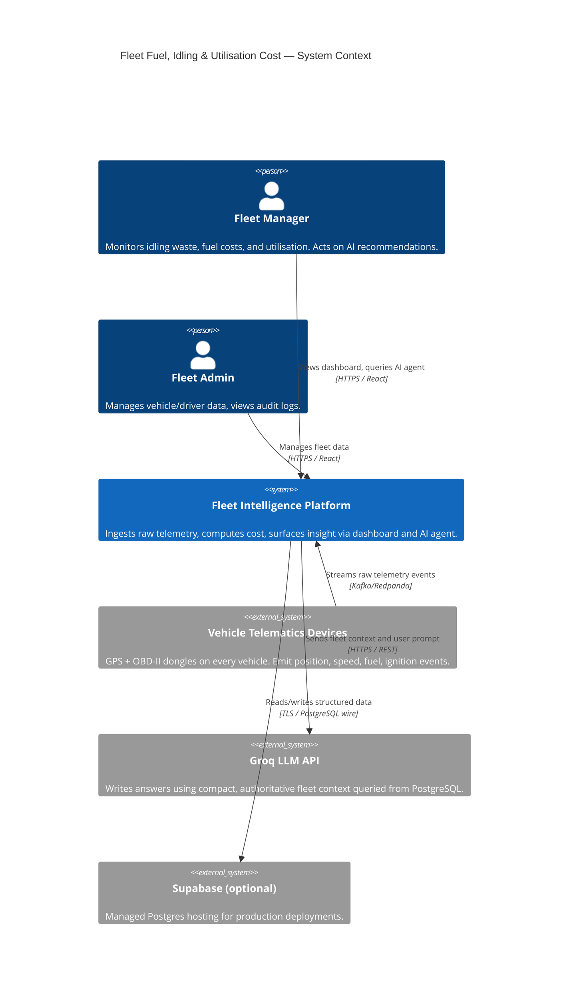
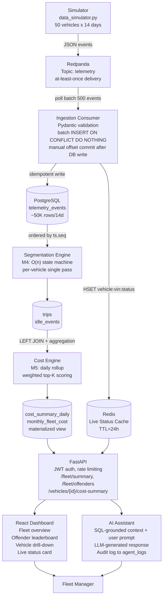
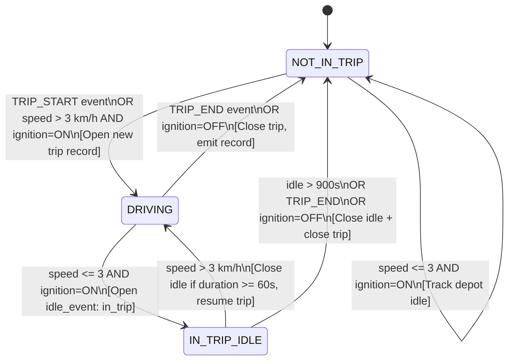
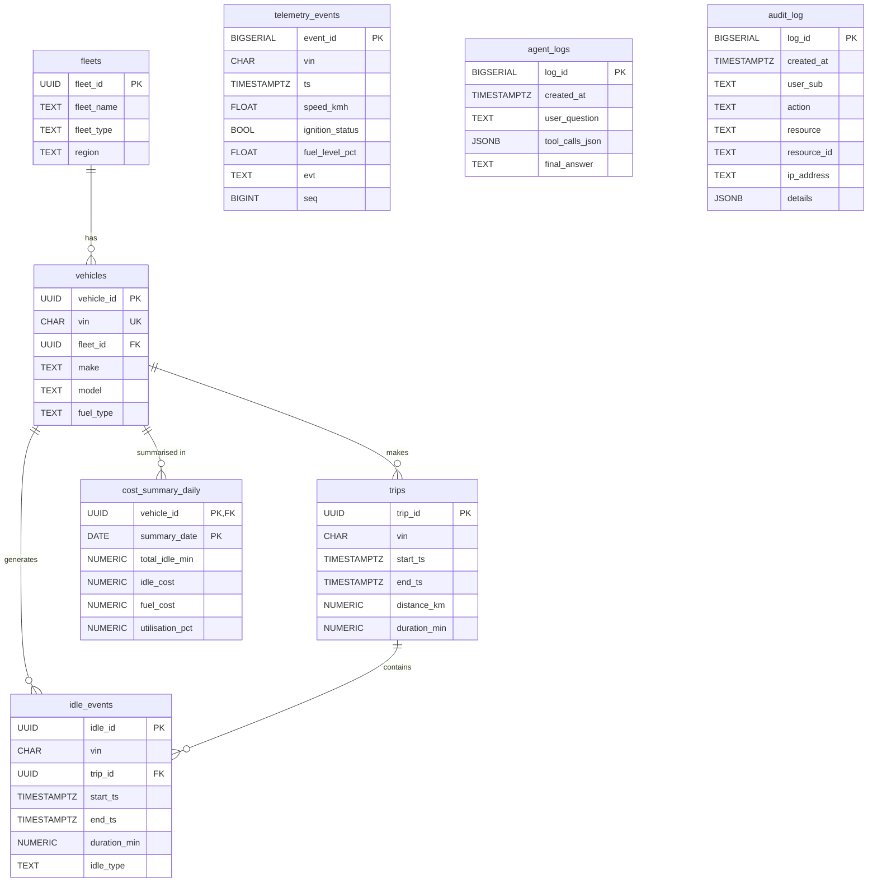
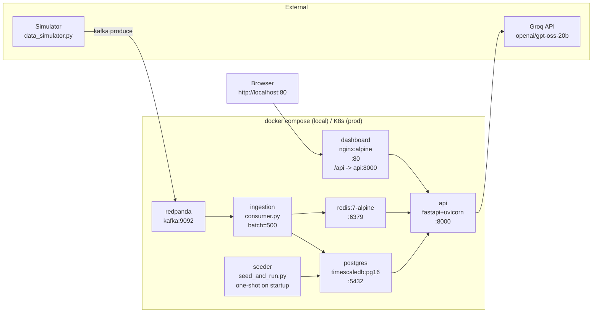
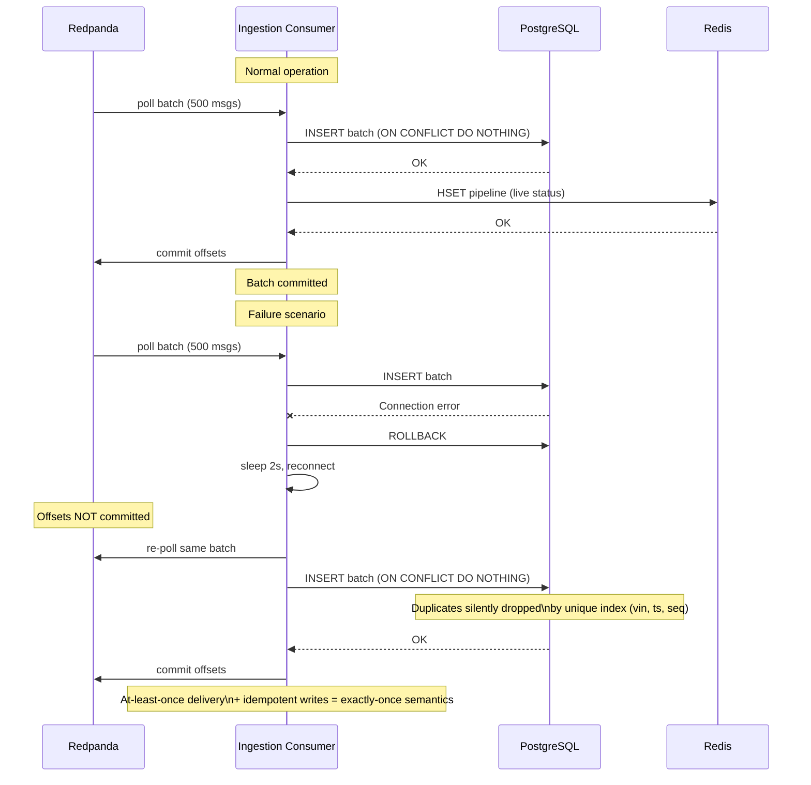
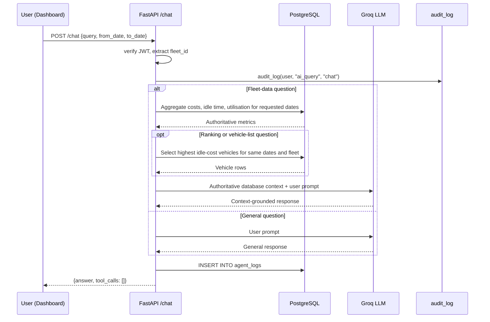

# Architecture Diagrams

> All diagrams are rendered as Mermaid. They are embedded in the Solution Document and in this file for reference.

---

## 1. C4 Context Diagram

---

## 2. Data-Flow Pipeline Diagram

---

## 3. Segmentation State Machine

---

## 4. Entity-Relationship Diagram (Key Tables)

---

## 5. Deployment Topology

---

## 6. Failure Sequence — Consumer Crash & Recovery

---

## 7. AI Assistant Context-Grounded Response Flow

