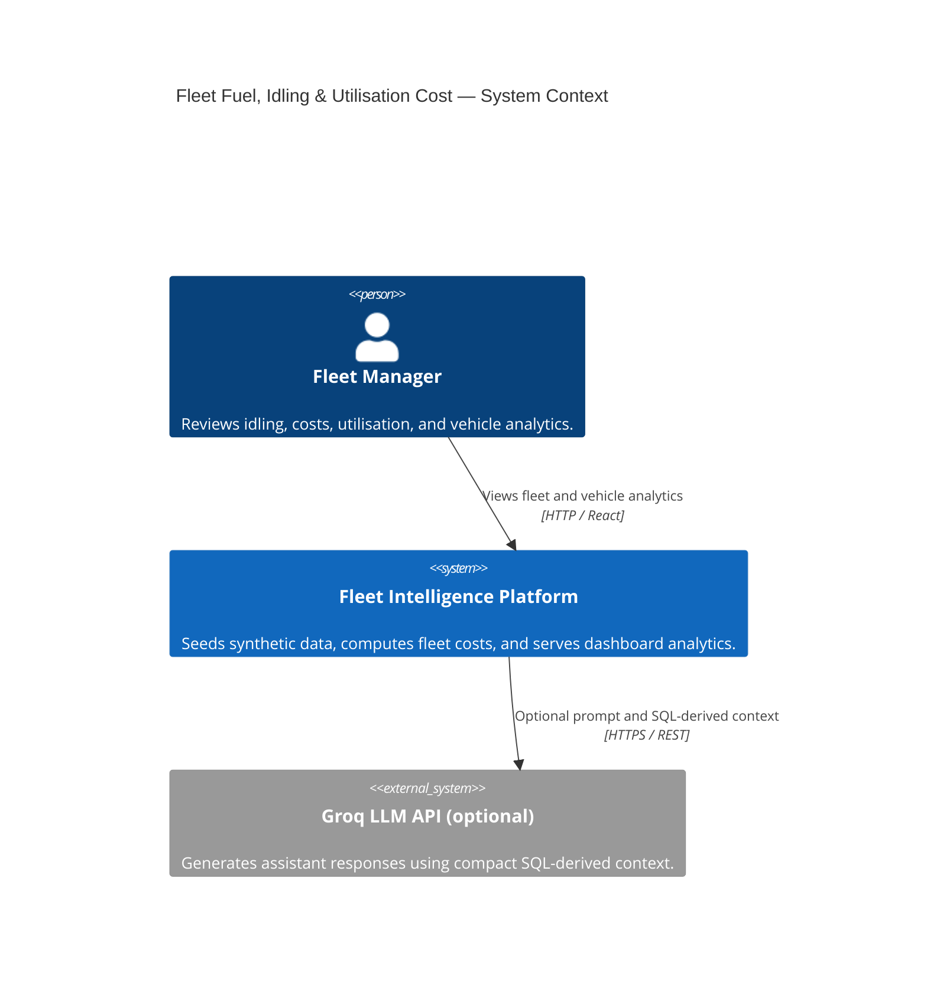
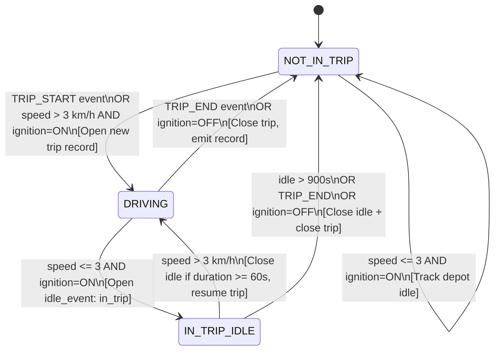
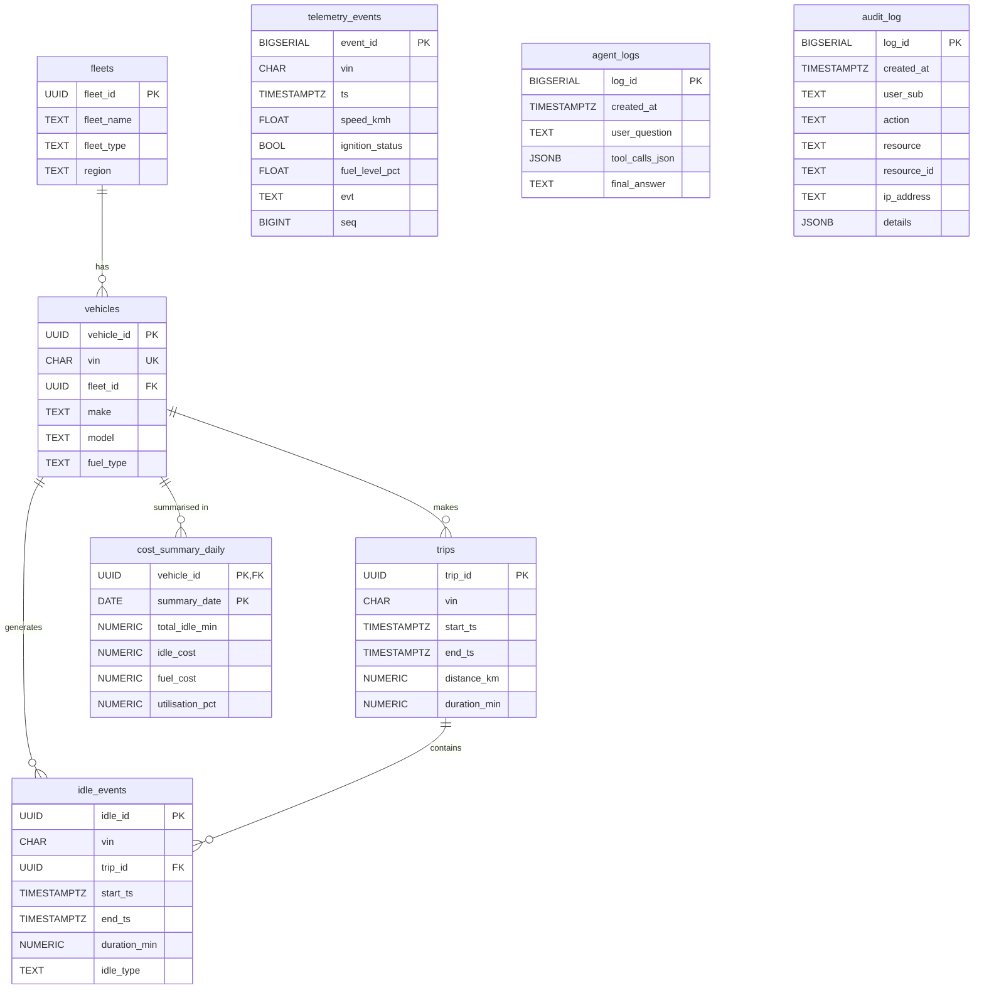
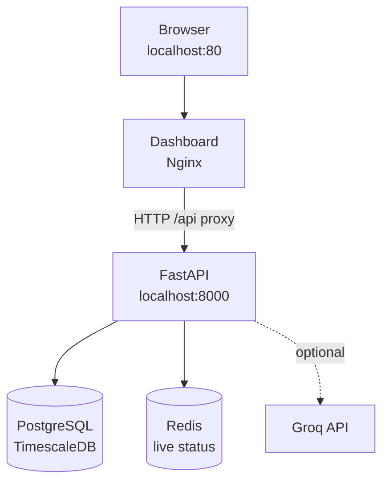
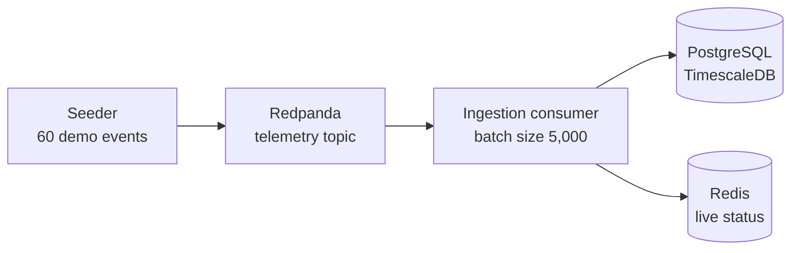
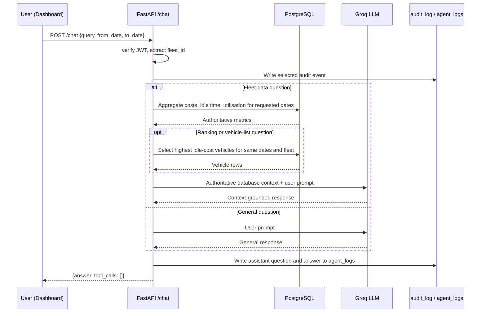

# Architecture Diagrams

> These Mermaid diagrams describe the current local demo. Cloud diagrams and
> scale figures should not be read as deployed or benchmarked production claims.

---

## 1. C4 Context Diagram



---

## 2. Batch Seed and Live-Event Data Flow

```mermaid
sequenceDiagram
    participant COMPOSE as Docker Compose
    participant SEED as One-shot seeder
    participant SIM as Route simulator
    participant DB as Local TimescaleDB
    participant RP as Redpanda
    participant ING as Ingestion consumer
    participant CACHE as Redis
    participant API as FastAPI
    participant UI as React dashboard

    COMPOSE->>SEED: Start after Postgres and Redpanda health checks
    SEED->>DB: Insert fleets and vehicles
    SEED->>SIM: Generate the selected seed profile
    SIM->>DB: Bulk-write telemetry
    SEED->>DB: Segment trips/idles and roll up daily costs
    SEED->>RP: Publish 60 sample live events
    SEED-->>COMPOSE: Exit successfully after publish
    Note over RP,ING: Consumer processes live events asynchronously; seeding does not wait for Redis updates
    RP->>ING: Deliver events from telemetry topic
    ING->>DB: Validate and idempotently persist
    ING->>CACHE: Update latest status per vehicle
    COMPOSE->>API: Start after successful seed
    COMPOSE->>UI: Start after API health check
    UI->>API: Request fleet summary, offenders, or vehicle detail
    API->>DB: Read derived analytics
    API-->>UI: Return dashboard data
```

The startup seed writes historical telemetry directly to Postgres; Redpanda
is a separate live-event path. The configured balanced profile is 1,000
vehicles × 7 days; the verified run produced 7,000 daily cost rows. Other
profile sizes are described in the README and scale report.

---

## 3. Segmentation State Machine



---

## 4. Entity-Relationship Diagram (Key Tables)



---

## 5. Local Deployment Topology

The local Compose stack is single-node. The diagrams are split by traffic
path so service dependencies remain easy to follow.

### Browser request path



### Telemetry ingestion path



The API and startup seeder connect directly to Postgres; the API reads live
status directly from Redis. PgBouncer is included and health-checked by
Compose, but the current API URL does not route through it. Groq is external
and optional. Kubernetes/Terraform files are unverified scaffolding, not part
of this local deployment.

---

## 6. Failure Sequence — Consumer Crash & Recovery

```mermaid
sequenceDiagram
    participant RP as Redpanda
    participant CON as Ingestion Consumer
    participant PG as PostgreSQL
    participant RD as Redis
    participant DLQ as telemetry-dlq topic

    RP->>CON: Poll records (up to configured batch)
    loop For each record in the polled batch
        CON->>CON: Parse JSON and validate schema
        alt Invalid record
            CON->>DLQ: Attempt to publish original record + error
            Note over CON,DLQ: Send failures are logged; processing continues
        else Valid record
            CON->>PG: Add event to batch insert
        end
    end
    opt At least one valid record
        CON->>PG: Persist valid events; commit database transaction
        CON->>RD: Update live-status cache
    end
    alt Database or Redis operation fails
        CON->>CON: Roll back open transaction; reconnect if needed
        Note over RP,CON: Offsets are not committed; records can be replayed
        Note over PG,RD: If Postgres had committed before Redis failed, the replayed DB inserts are idempotent
    else Batch handling succeeds
        CON->>RP: Commit offsets
    end
```

Postgres insertion is committed before the Redis update, so the stores are
not atomic. On a Redis failure, Kafka offsets remain uncommitted and replayed
event inserts are idempotent, but the Redis update must still succeed before
offsets are committed. A dead-letter send failure is a known gap: the helper
logs that failure while the consumer can still advance the offset. This local
implementation does not promise zero data loss under every failure mode.

---

## 7. AI Assistant Context-Grounded Response Flow


