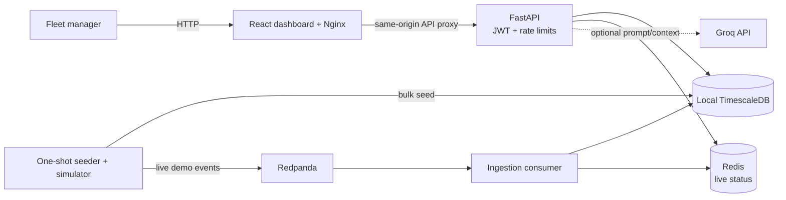

# Fleet Fuel, Idling, and Utilisation Intelligence

> **Submission status:** technical solution narrative, aligned to the supplied
> solution-document template. Team metadata, final screenshots, repository
> submission URL, and the ≤5-minute demo-video link are submission inputs not
> present in this repository. This document distinguishes observed evidence
> from targets and unverified deployment/scale claims.

## 1. Executive summary

Fleet managers need to see where fuel and idling create avoidable operating
costs. This project generates synthetic mixed-fuel fleet telemetry, segments
trips and idle periods, calculates daily INR costs, and presents weekly
fleet-level and vehicle-level insights in a web dashboard.

The verified local judge workflow starts with `docker compose up --build`.
The balanced seed produces 1,000 vehicles × 7 days and computes analytics for
all 1,000. A fresh run contained 969,819 telemetry events after the 60 live
demo events, 7,000 daily cost rows, and 1,000 vehicles in the summaries.
This demonstrates the local product flow—not the challenge's 100K-vehicle
minimum or its 100K-events/sec throughput target.

## 2. Problem statement and validation

### 2.1 Problem statement

**Primary user:** fleet manager responsible for operating cost and vehicle
utilisation.

**Job to be done:** a fleet manager needs a way to identify vehicles with
avoidable idling and high fuel/energy costs because raw telemetry is noisy and
does not directly explain operating cost. No real customer interviews,
published impact study, or production fleet data are represented in this
submission. Accordingly, no monetary savings claim is made.

### 2.2 Evidence and validation

Synthetic reference assumptions:

| Input | Assumption |
|---|---:|
| Petrol efficiency | 12 km/L |
| Diesel efficiency | 15 km/L |
| Hybrid efficiency | 18 km/L |
| EV efficiency | 5.5 km/kWh |
| Idle burn | Petrol 0.6 L/h; diesel 0.5 L/h; hybrid 0.3 L/h; EV 0.9 kWh/h |
| Reference prices | Petrol/hybrid ₹103/L; diesel ₹92/L; electricity ₹8/kWh |
| Scheduled shift | 600 minutes/day |

These values are illustrative, not live local prices, calibrated vehicle
measurements, or validated savings estimates. Assumptions and formulas are
documented in [`algorithms.md`](algorithms.md).

| Evidence / assumption | Method | What it supports | Confidence |
|---|---|---|---|
| Local event, trip, and cost data | Deterministic synthetic simulator | End-to-end product behavior, not real-world prevalence or savings | High for repeatability; low for real-world validity |
| Fuel economy, idle burn, energy/fuel prices | Fixed simulator/reference constants listed above | Consistent illustrative INR calculations | Low as a real-fleet estimate |
| User pain and alternatives | Problem framing only; no user interviews or competitor study recorded | Product hypothesis, not market validation | Low |

### 2.3 Impact and success metrics

| Metric | Baseline / target | Current evidence | Interpretation |
|---|---|---|---|
| Vehicles with weekly cost rollups | 1,000 in local demo | 1,000 represented; 7,000 daily rows | Product-path evidence only |
| API p95 | <200 ms target | 38 ms in a 30-second local smoke test | Limited local evidence; no scale/soak claim |
| Streaming ingest | 100K events/sec challenge target | ~8,234 events/sec in a short local check | Target unmet |
| Cost savings | No quantified baseline/target | Not measured | Requires a real pilot and validated cost assumptions |

There is no measured 10K/100K-fleet operational impact or environmental
reduction claim. At larger fleet sizes, estimated value should be measured
with operator-approved rates and a real baseline rather than multiplying this
synthetic result.

## 3. Solution description

### 3.1 Overview and user journey

The dashboard turns generated telemetry into daily fleet cost, utilisation,
and ranked vehicle insights. The user journey is:

1. Compose creates fresh local stores and seeds the fleet, route telemetry,
   trip/idle records, and daily cost rollups.
2. A fleet manager opens the dashboard and signs in with the explicitly
   documented local demo credentials.
3. The overview reports the latest seven available data days.
4. The offender page progressively loads ranked vehicles in pages; selecting
   a vehicle opens its weekly cost detail.
5. The optional assistant can use SQL-derived fleet context when a Groq API
   key is configured.
6. `docker compose down -v` stops the stack and removes its disposable data.

Screenshot: **pending capture from a fresh local run**. No screenshot is
embedded or claimed as evidence in this repository.

### 3.2 Value proposition

The fleet manager's job is to decide where to investigate operating waste.
This prototype makes that investigation easier by surfacing a weekly summary,
ranked offenders, and vehicle drill-down from one synthetic dataset. Its
differentiation is the joined trip/idle/cost workflow and a progressively
loaded offender view; the benefit is not yet validated with customers or
measured against competing products.

### 3.3 Innovative ideas

1. **Route-consistent synthetic data:** generated trips, stops, refueling, and
   energy usage form a coherent demo workload rather than independent random
   readings. Verified only for simulator/test behavior.
2. **Cost-oriented idle leaderboard:** a weighted score combines idle cost,
   idle percentage, and idle minutes to prioritize review. Unit tests exercise
   ranking behavior; field usefulness is not user-validated.
3. **One-command disposable walkthrough:** Compose starts services and gates
   API startup on the one-shot seed. Fresh startup was locally verified; the
   ephemeral data path is removed by `docker compose down -v`.

## 4. Feature list

| Feature | Priority | Status | Code |
|---|---|---|---|
| Synthetic mixed-fuel telemetry and fresh local seed | Must | **Verified at 1K × 7 days** | `services/segmentation/seed_and_run.py`, `simulator/data_simulator.py` |
| Trip/idle segmentation and daily cost rollup | Must | **Implemented; local demo verified** | `services/segmentation/segment.py`, `services/segmentation/cost_engine.py` |
| Weekly fleet overview and vehicle detail | Must | **Local demo verified** | `services/api/main.py`, `dashboard/src/components/Overview.jsx`, `VehicleDetail.jsx` |
| Progressive offender leaderboard | Should | **Implemented; API returned 1,000 total offenders** | `services/api/main.py`, `dashboard/src/components/Leaderboard.jsx` |
| Streaming ingest and Redis live status | Must | **Functional path; performance target not met** | `services/ingestion/consumer.py` |
| Context-grounded assistant | Could | **Optional; requires external Groq service/key** | `services/api/main.py`, `dashboard/src/components/AIAssistant.jsx` |
| 100K-vehicle dataset | Must (challenge) | **Not verified** | `SEED_MODE=full` exists but has not been run |
| 100K events/sec, 3× five-minute burst | Must (NFR) | **Not met / not verified** | See [`scale-benchmark.md`](scale-benchmark.md) |

Feature priorities are provisional product priorities, not independently
validated user research. No demo timestamps are supplied because the required
video has not been recorded.

## 5. Solution architecture

### Context and user-facing services

The full context, deployment, sequence, and entity diagrams are in
[`architecture.md`](architecture.md). The local topology is:

The startup seed is a bulk database path followed by segmentation and cost
rollup. Redpanda/consumer is a separate live-event path. The ordinary judge
workflow is local Compose and single-node; Kubernetes/Terraform artifacts are
not a verified cloud deployment.

### Technology choices

| Layer | Choice | Purpose / caveat |
|---|---|---|
| Event log | Redpanda, Kafka protocol | Replayable telemetry topic; one local broker is not HA. |
| Relational/time-series | PostgreSQL + TimescaleDB | Master data, raw events, derived trips/idles/costs. |
| Cache | Redis | Ephemeral live vehicle status. |
| Processing | Python simulator, state machine, SQL rollup | Reproducible synthetic history and daily cost analysis. |
| API/UI | FastAPI, React/Vite, Nginx | Authenticated analytics and dashboard. |
| Assistant | Optional Groq LLM | Receives structured SQL context; no vector store or model evaluation. |

Rejected alternatives and trade-offs are recorded in
[`adrs.md`](adrs.md). Compose is the only verified deployment topology.

### Data architecture

PostgreSQL/TimescaleDB stores master data, raw telemetry, trips, idles, cost
summaries, and selected logs; Redis holds ephemeral live status; Redpanda
provides the replayable event path. See [`architecture.md`](architecture.md)
for the ER diagram. The current measured 1K × 7 dataset used ~324 MiB for the
whole local database. The dense 100K × 7 estimate is ~34 GB and is an
extrapolation, not an achieved result. The local demo does not implement a
validated hot/warm/cold retention lifecycle.

Recorded small-dataset SQL plans and their limitations are in
[`query-optimisation.md`](query-optimisation.md); they should not be presented
as 100K-scale performance measurements.

### Deployment view

The local Compose deployment is single-node and uses plaintext internal
networking. Postgres, Redis, and Redpanda use temporary filesystems for the
modest demo. `docker compose down -v` removes the Compose resources and any
anonymous volumes; the next startup seeds fresh state. Kubernetes/Terraform
scaffolding is not a cloud deployment and has not been verified.

## 6. Low-level design

### 6.1 Layering and separation of concerns

The repository uses service-oriented modules, not a strict ports-and-adapters
or clean-architecture boundary. The API module contains HTTP/auth handling and
database query logic; the segmentation service owns seed orchestration,
segmentation, and cost calculation; ingestion validates and persists broker
events; the React application owns dashboard presentation. This pragmatic
prototype separation is not evidence of fully isolated domain/application
layers.

- Telemetry is stored in TimescaleDB and uniquely identified by `(vin, ts,
  seq)` for idempotent writes.
- Segmentation walks ordered telemetry rows with an O(n) per-vehicle state
  machine to create trips and idle events.
- Fuel/SOC deltas are converted using the corresponding vehicle tank/battery
  capacity. Idle cost uses documented fuel/energy burn assumptions.
- Offenders are ranked using a weighted score combining normalized idle cost,
  idle percentage, and idle minutes.
- `/vehicles` uses keyset pagination. `/fleet/offenders` uses offset paging
  for the progressively loaded leaderboard.

The relational model, field-level schema, thresholds, and SQL plans are
documented in [`architecture.md`](architecture.md),
[`algorithms.md`](algorithms.md), and
[`query-optimisation.md`](query-optimisation.md).

### 6.2 Principles and patterns

- **Idempotent event writes:** database uniqueness on `(vin, ts, seq)` and
  `ON CONFLICT DO NOTHING`; this does not make Redis and Postgres one atomic
  transaction.
- **Configuration/disposability:** service configuration is environment
  driven; local data stores are disposable.
- **State machine:** ordered telemetry is segmented in a deterministic
  per-vehicle pass.
- **At-least-once ingestion:** broker offsets are committed after database
  handling; event persistence is idempotent for duplicate keys.
- **Not implemented/verified:** comprehensive retry/circuit-breaker behavior,
  outbox, strict repository/domain layering, and distributed transactions.

### 6.3 Interfaces, contracts, and runtime flows

The API contract is in [`openapi.json`](openapi.json), but synchronization
with the current API has not been confirmed. The streaming topic is
`telemetry`; events are JSON validated by Pydantic. The current event path does
not have a schema registry or a documented compatibility/evolution policy.
The API has JWT-protected routes and configured rate limits; it does not claim
OAuth/OIDC or a fully versioned public contract. See the API and failure
sequence diagrams in [`architecture.md`](architecture.md).

### 6.4 Algorithms and complexity

Trip/idle segmentation is a single pass over time-ordered telemetry per
vehicle: O(n) time and O(1) current state per vehicle, apart from emitted
records. Cost rollups aggregate derived daily facts. Offender ranking requires
aggregation and sorting/limiting over candidate vehicles. The 1K × 7 run is
the current verified seed size; no 100K × 7 runtime is available.

## 7. Non-functional requirements and performance benchmarks

| Target | Evidence | Status |
|---|---|---|
| Default local startup and usable dashboard | Fresh `docker compose up --build`; health, login, summary, offender API and dashboard responded | **Verified locally** |
| 100K simulated vehicles | Local verified seed is 1K × 7; full profile is unrun | **Not verified** |
| 100K events/sec sustained | Separate short streaming test ~8,234 events/sec | **Not met by measured test** |
| 3× burst for 5 min without loss | No qualifying test | **Not verified** |
| API p95 < 200 ms | Separate 30-second local API smoke load measured p95 38 ms | **Partial evidence; not a scale/soak test** |
| 80% core test coverage | Saved selected-module report shows 35% total | **Not met** |

Benchmark methodology, local storage measurement, workload limitations, and
scale extrapolations are in [`scale-benchmark.md`](scale-benchmark.md) and
[`load-test-results.md`](load-test-results.md). An extrapolation is not a
completed test.

The 100K-vehicle dataset requirement is distinct from the 100K-events/sec
streaming requirement. The next scale-profile proposal is to preserve the
existing `balanced` default and add a separately selected `scale` profile for
100,000 vehicles across seven days. To keep resource use bounded while
retaining analytical meaning, that profile should generate sparse but
coherent route samples for **every** vehicle/day (trip starts/ends, movement
points, idle boundaries, refueling/charging) and run cost summaries for all
vehicles. Before implementation, compare its exact event density and storage
against the dense ~34 GB extrapolation. It must not silently substitute a
100K × 1-day seed or claim one-minute telemetry for all vehicles.

Recommended interface: default `SEED_MODE=balanced` remains 1K × 7; explicit
`SEED_MODE=scale` selects 100K × 7. A dedicated scale Compose override should
write database files to a disposable disk-backed Docker volume rather than
tmpfs, with `docker compose ... down -v` deleting the volume. The scale run
should be opt-in and should print the chosen profile, expected/actual vehicle
and event counts, analytics coverage, elapsed time, peak memory, database
size, and cleanup result. This profile is **planned, not implemented or
verified**. It tests batch data/analytics at fleet size; a separate streaming
load generator is still required to test events/sec, latency, lag, failures,
and burst behavior.

## 8. Security and compliance

The API uses JWT authentication, fleet-scoped query filters, request
validation, rate limits, and selected audit records. The local Compose setup
uses known demo credentials/signing-key fallback and plaintext networking.
Audit coverage is incomplete and audit-write failures do not fail requests.
The saved Trivy scan predates the current image. TLS/mTLS, secret management,
comprehensive access auditing, location masking, and verified erasure/retention
are not implemented. See [`security.md`](security.md).

## 9. Test strategy and current results

Unit, contract, segmentation, cost, and simulator tests are in `tests/`;
GitHub Actions has unit, frontend, integration, and image-build jobs.
The latest focused seed-profile test invocation passed 5 tests. A separate
host test invocation could not collect simulator tests because NumPy was not
installed in that host environment. The saved partial coverage report is 35%,
below the 80% target. CI integration credentials were aligned to Compose's
local default; current CI execution is still pending.

| Test area | Evidence | Status |
|---|---|---|
| Focused seed profile | 5 passed | Verified in current workspace |
| Broader local Python suite | Prior collection blocked by missing NumPy | Not fully verified |
| API smoke journey | Previous fresh Compose run returned health, summary, offenders, detail | Local evidence; rerun in current verification |
| Frontend lint/build | CI workflow configured | To be run during this verification |
| Integration CI workflow | Updated to use Compose defaults and cleanup | Not run on GitHub in this session |
| Coverage | Saved report 35% on selected modules | Below 80% target |
| Security image scan | Earlier scan only | Current image requires rescan |

## 10. Observability and data lifecycle

Services emit application logs; the consumer logs batch counts and lag. There
is no verified centralized metrics/traces stack, alerting, or failure-recovery
exercise. Local Postgres, Redis, and Redpanda data use temporary filesystems.
The supported cleanup command is `docker compose down -v`; a following startup
starts from empty stores and reseeds.

## 11. AI component

The optional assistant fetches SQL-derived fleet context for fleet-data
questions and passes that context with the prompt to Groq. No RAG/vector store
or model training is used. It is not evaluated against a labeled benchmark;
the external model may still misstate supplied context, and general questions
require an external API key. No measured cost/latency, model fallback, or
comprehensive prompt-injection evaluation is claimed.

## 12. Architecture decisions, risks, and future enhancements

Five ADRs are documented in [`adrs.md`](adrs.md). The main open risks are the
unverified 100K-vehicle dataset, throughput/burst gap, sub-target test
coverage, untested cloud scaffolding, image vulnerabilities, and incomplete
security/compliance controls.

Next steps: (1) verify CI and finish the local product walkthrough; (2)
implement the opt-in sparse 100K × 7 seed plus disposable disk-backed Compose
override and validate analytics coverage on a suitably provisioned runner;
(3) run a separate sustained and burst streaming benchmark, then address
coverage, image findings, and production security controls. Do not present
local extrapolations as achieved requirements.

## 13. Demo video (maximum five minutes)

Video link: **pending recording**. Suggested sequence: 0:00–0:30 problem and
synthetic-data disclaimer; 0:30–1:00 value proposition; 1:00–3:00 local
dashboard, seven-day fleet costs, progressively loaded offender list, and
vehicle drill-down; 3:00–4:15 architecture and measured-vs-unverified scale
status; 4:15–5:00 teardown command and next steps. Record a real fresh run;
do not use an unverified scale claim as the product demo.

## 14. Repository checklist

| Checklist item | Status |
|---|---|
| README, quick start, environment and known limitations | Documented |
| One-command local run and disposable data | Locally verified previously; being rerun |
| Service folders, docs, tests, infrastructure artifacts | Present |
| CI build/test workflow | Present; integration credential alignment fixed; not yet run on GitHub |
| `.env.example` | Present; contains example values, not a secrets-management solution |
| Final tag `v1.0-submission` | Not confirmed |
| Current image security scan | Pending |

## 15. Conclusion

The project now provides a coherent local fleet analytics walkthrough and
honest evidence boundaries. The most important completed work is the
synthetic-to-dashboard path, weekly rollups, disposable startup lifecycle, and
traceable documentation. The main challenge is converting a functioning small
demo into verified large-fleet and streaming performance evidence without
overstating results.

## 16. Declarations

- **Synthetic data:** all vehicle telemetry and cost outputs used by this demo
  are generated; no real personal or vehicle-owner data is intentionally used.
- **AI assistance:** Google Antigravity was used for planning, code/document
  drafting, and tests; Groq is an optional runtime response service. The team
  must review and validate submitted work.
- **Open source:** dependencies are listed in project manifests. A complete
  license/SBOM review has not been performed.

## 17. Submission details and appendix

| Item | Status |
|---|---|
| Team name and member roles | To be supplied |
| Repository/submission URL | To be supplied |
| Working-product screenshot(s) | To be captured from a fresh demo run |
| Demo video (≤5 minutes) | To be recorded and linked |
| Final tag `v1.0-submission` | Not confirmed |
| Cloud deployment evidence | Not available; IaC is untested |

Supporting diagrams, scale estimates, load results, algorithm formulas, and
security limitations are linked throughout this document and collected in
[`architecture.md`](architecture.md), [`scale-benchmark.md`](scale-benchmark.md),
[`load-test-results.md`](load-test-results.md), [`algorithms.md`](algorithms.md),
and [`security.md`](security.md). The official supplied DOCX remains a
submission-format template; this Markdown document is the maintained,
version-controlled technical narrative. Export and final metadata entry are
still needed before submission.
